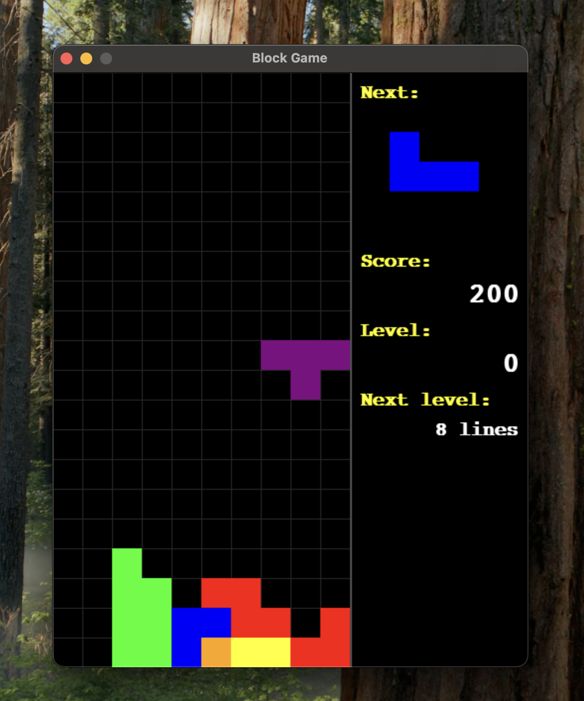

# Tetris Game

Este es un proyecto de Tetris desarrollado en Python utilizando la librería Pygame.

Actualmente el juego es completamente funcional, incluye sistema de puntuación, niveles, panel lateral con información, reinicio tras Game Over, controles clásicos y una interfaz gráfica mejorada. Además, el código está modularizado y preparado para futuras ampliaciones (sonidos, mejoras visuales, etc.).

## Requisitos

- Python 3.8 o superior
- Pygame (ver `requirements.txt`)

## Instalación

1. Clona este repositorio:
   git clone https://github.com/CarrasDev/Tetris_Game.git
   cd Tetris_Game

2. Crea y activa un entorno virtual:
   python3 -m venv env
   source env/bin/activate  # En Windows usa `env\Scripts\activate`

3. Instala las dependencias:
   pip install -r requirements.txt

## Ejecución

Desde la raíz del proyecto, ejecuta:

   python main.py

## Estructura del proyecto

Tetris_Game/
│
├── main.py                # Archivo principal para ejecutar el juego
├── ui.py                  # Funciones de interfaz gráfica y panel lateral
├── config.py              # Constantes de configuración global
├── requirements.txt       # Dependencias del proyecto
├── assets/                # Recursos (sonidos, imágenes, etc.)
│   └── sounds/
│       ├── tetris_sound_apple.mp3
│       ├── tetris_sound_game_over.mp3
│       ├── tetris_sound_grow.mp3
│       └── tetris_sound_squish.mp3
├── game/                  # Módulos de la lógica del juego
│   ├── __init__.py
│   ├── board.py
│   ├── game.py
│   ├── piece.py
│   └── shapes.py
├── LICENCE
└── README.md

## Controles

- ← → ↓ ↑ : Mover y rotar piezas
- Barra espaciadora: Caída instantánea
- P: Pausar/reanudar el juego
- Cualquier tecla: Reiniciar tras Game Over

## Pendiente / Mejoras

- Añadir sonidos y música de fondo
- Mejorar interfaz gráfica

## Capturas de pantalla

¡Disfruta jugando y aprendiendo con este Tetris en Python!
Si tienes sugerencias o encuentras bugs, no dudes en abrir un issue o un pull request.

Hecho con ❤️ por CarrasDev